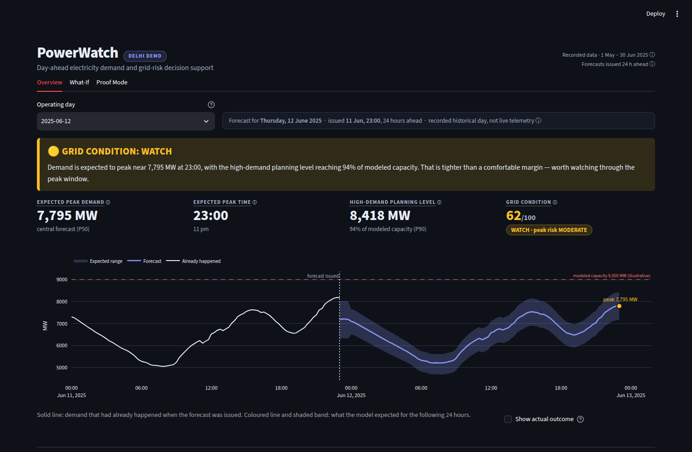
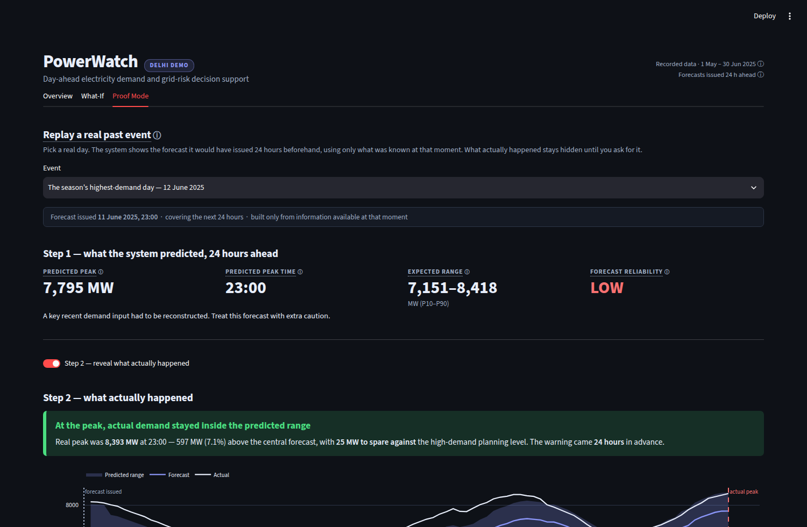
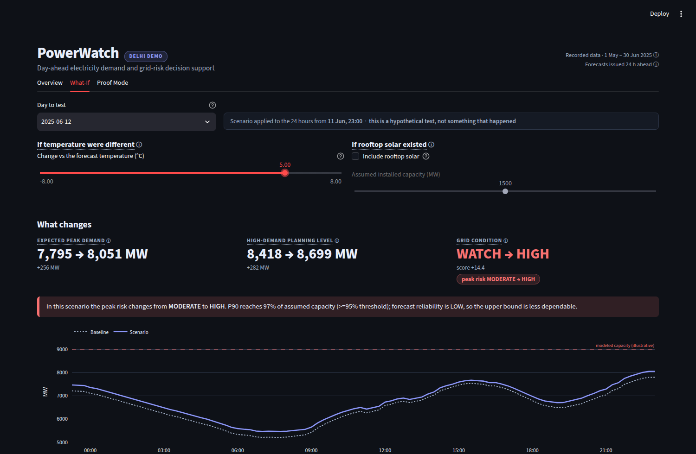
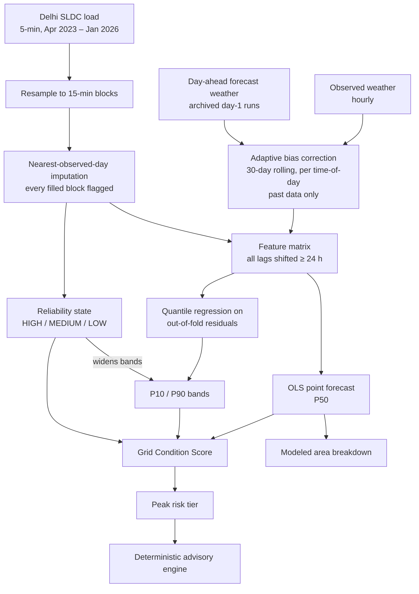

# ⚡ PowerWatch — Delhi Peak Demand Intelligence

**A day-ahead electricity demand forecasting and grid-risk decision support system for Delhi — that also tells you when *not* to trust it.**

Built for **Origin Hackathon PS-1: AI-based Electricity Demand Prediction System**.


<!-- Add the Streamlit Cloud URL here once deployed -->



---

## The problem

Delhi's peak power demand keeps setting records every summer — **8,392.6 MW** on 12 June 2025 in our own dataset, and higher still in 2024. DISCOMs and the SLDC have to commit to power procurement a day in advance. Get it wrong low and you risk load-shedding; get it wrong high and you pay for reserve capacity nobody used.

The hard part isn't drawing a demand curve. It's that **a forecast without a trust level is not a decision tool.** An operator staring at "8,400 MW tomorrow" has no way to know whether that number came from clean telemetry or from a sensor gap papered over with last week's data.

PowerWatch forecasts demand 24 hours ahead **and** reports how much that particular forecast should be trusted, how close it comes to capacity, which part of the city carries the pressure, and what a real past event proves about its track record.

---

## What it does

| | |
|---|---|
| 📈 **Forecasts 24 h ahead** | 15-minute resolution, using only information that existed at issue time |
| 🎯 **Quantifies uncertainty** | P10 / P50 / P90 bands that widen when the input data is poor |
| 🚦 **Flags its own reliability** | HIGH / MEDIUM / LOW, driven by how much input data had to be reconstructed |
| ⚠️ **Scores grid risk** | A 0–100 Grid Condition score combining demand, uncertainty, growth, heat and reliability |
| 🗺️ **Localises pressure** | Modeled demand split by area of Delhi (BRPL / BYPL / TPDDL / NDMC+MES) |
| 🌡️ **Tests scenarios** | "What if it's 5 °C hotter?" genuinely re-runs the real model |
| ☀️ **Models rooftop solar** | Disclosed daylight-generation assumption, kept separate from the ML model |
| 🕵️ **Proves itself** | Proof Mode replays real past events using only pre-event information |
| 📋 **Recommends actions** | Deterministic rule engine — no LLM, no vague "AI suggests…" text |

---

## What makes this different

Most forecasting demos show you their best day. This one is built to survive scrutiny.

**1. The forecast is genuinely 24 hours ahead.**
Every lag and rolling feature is constructed with an explicit ≥24 h shift at the point the feature matrix is built — so leakage-safety is structural, not a per-function promise. Proof Mode carries a runtime assertion that *refuses to serve* a replay window if it could contain post-issue-time information.

**2. Tomorrow's weather is a forecast, not hindsight.**
We use a real archived day-ahead weather forecast, never the observed temperature for the target hour. Because that forecast is measurably cold-biased, we apply an adaptive per-time-of-day bias correction computed from the **past 30 days only**.

**3. The system knows when it's unreliable.**
Missing demand telemetry is reconstructed from the nearest observed day — and every reconstructed block is flagged, which downgrades the forecast's reliability rating and widens its uncertainty band.

**4. It shows its own failures.**
Proof Mode ships with two events chosen by objective rule, not cherry-picked: the season's biggest day, **and the forecast's worst miss**. On the flagship event the model under-forecast the real peak by **597 MW (7.1%)**. That's on screen, not buried.

**5. It never invents data it doesn't have.**
No fake feeder telemetry. No decorative map. DISCOM figures are labelled **modeled estimates** everywhere they appear, because feeder-level data isn't public — and the UI says so.

> We chose a simple, transparent OLS model over XGBoost **because we tested both and OLS won** — 6.33% vs 6.57% MAPE, and better on every peak-specific metric. The sophistication is in the pipeline, not the model class.

---

## Results

Measured on a **held-out test period (1 May – 30 June 2025, 5,817 fifteen-minute blocks)** the model never trained on.

| Metric | Result |
|---|---|
| Overall MAPE | **5.94%** |
| MAPE at each day's actual peak | **5.16%** |
| Actual within P90 | 86.6% of blocks |
| Actual within P10–P90 band | 73.1% of blocks |
| Warning lead time | 24 hours |

**Model selection (Phase 2, identical conditions):**

| Model | MAPE | Peak-day MAPE | Daily-peak MAPE |
|---|---|---|---|
| **OLS (chosen)** | **6.33%** | **7.47%** | **5.76%** |
| XGBoost | 6.57% | 8.43% | 6.21% |
| Naive (same time last week) | 12.97% | 19.22% | 15.61% |

*Model-selection figures come from an earlier pipeline stage than the 5.94% headline, which reflects the final locked configuration with nearest-day imputation.*

---

## 🕵️ Proof Mode — the credibility feature



Pick a real day. The system shows the forecast it **would have issued 24 hours earlier**, using only what was known then. The outcome stays hidden until you ask for it.

**12 June 2025 — the season's peak:**

| | |
|---|---|
| Forecast issued | 11 Jun 2025, 23:00 |
| Predicted peak | 7,795 MW (range 7,151 – 8,418) |
| Reliability flag | **LOW** — a key input had been reconstructed |
| **Actual peak** | **8,392.6 MW at 23:00** |
| Error | −597 MW (7.1% under) |
| Verdict | Inside the planning band at the peak — by **25 MW** |

The model called the **exact 15-minute block** of the peak a day early, under-forecast its size, and the actual landed just barely inside the upper band. It also flagged itself as low-confidence beforehand. All four facts are shown together.

The second built-in event is **11 June 2025 — the forecast's worst miss**, where actual demand broke *through* the band by 247 MW. Included on purpose.

---

## 🌡️ What-If scenarios



The temperature slider genuinely re-runs the fitted model — it is not a lookup table.

**+5 °C on 12 June 2025:** peak rises 7,795 → **8,051 MW**, P90 reaches **97%** of the modeled capacity reference, and grid condition escalates **WATCH → HIGH**. This is the only state anywhere in the system — real or simulated — that reaches HIGH risk, and it is always labelled as a hypothetical scenario.

Rooftop solar is modelled as a disclosed half-sine daylight curve subtracted *after* the model. A genuine finding falls out of this: on 12 June, solar changes the peak by **zero**, because the peak occurs at 23:00, well after sunset. Solar flattens the midday shoulder; it cannot touch a night-time peak.

---

## Quick start

```bash
git clone https://github.com/kartikeyyyyyaa/HackU.git
cd HackU

python -m venv .venv
# Windows
.venv\Scripts\activate
# macOS / Linux
source .venv/bin/activate

pip install -r requirements.txt
streamlit run src/phase15_dashboard_app.py
```

Opens at `http://localhost:8501`. **Runs fully offline** — all data is local CSV, and the app makes zero network calls.

<details>
<summary>Optional: custom data directory</summary>

The app resolves `data/` relative to the repo root. To point elsewhere, set `HACKU_DATA`:

```bash
export HACKU_DATA=/path/to/data     # Windows: set HACKU_DATA=C:\path\to\data
```
</details>

---

## How it works



**Grid Condition Score** = weighted combination of expected demand vs capacity (37.5), planning level vs capacity (37.5), day-on-day growth (10), heat (10) and data reliability (5). Weights were fixed by a documented A/B/C design experiment before the final build — not tuned afterwards to flatter the results.

---

## What this system does **not** do

Stated plainly, because a decision-support tool that hides its limits isn't one.

- **It is not live.** It runs on recorded historical data (1 May – 30 Jun 2025). No date is ever presented as "today".
- **No feeder-level telemetry.** Delhi feeder data isn't public. Area-level figures are modeled estimates from disclosed allocation ratios — never presented as measurements.
- **The 9,000 MW capacity line is illustrative**, chosen for this project. It is not an official DISCOM or SLDC declared limit.
- **All MW values are 15-minute averages.** A true instantaneous peak can exceed any figure shown.
- **Next-day only, not next-week.** Our archived weather forecast has a day-1 horizon only, so a 7-day model could not be validated honestly. We shipped the horizon we could prove.
- **The test period ends 30 June 2025** because the day-ahead forecast weather ends there. There are 195 days of later load data we deliberately *don't* score against, rather than relax the standard.
- **The stress score is internally consistent, not operationally validated.** It has never been checked against real operator decisions.
- **No real day reached HIGH risk** in the test period (54 LOW, 7 MODERATE, 0 HIGH). HIGH-risk behaviour is demonstrated only via the labelled +5 °C scenario.

---

## Project structure

```
HackU/
├── data/                       # 3 real input CSVs (load, observed weather, forecast weather)
├── src/
│   ├── phase13_backend.py      # ← the entire forecasting + risk + advisory engine
│   ├── phase15_dashboard_app.py# ← the dashboard you run (V2, current)
│   ├── phase13_dashboard_app.py# V1 dashboard, kept as a working fallback
│   └── phase1…phase12_*.py     # the research trail (see below)
├── outputs/                    # every phase's report, results JSON, figures, predictions
├── docs/                       # screenshots
└── requirements.txt
```

Only two files run in the demo: **`phase13_backend.py`** (all logic) and **`phase15_dashboard_app.py`** (all presentation). Everything else is the evidence trail.

---

## How it was built — 15 documented phases

Each phase re-derives the previous phase's approved pipeline unchanged, adds exactly one capability, tests it, and writes a full report to `outputs/` before moving on. Highlights:

| Phase | What it settled |
|---|---|
| 1 | Baseline forecast — and the discovery that an early feature made it a *nowcast*, not a 24 h forecast. Fixed. |
| 2 | OLS vs XGBoost head-to-head — **plus a forensic audit that found a rolling-window bug silently deleting 42,111 rows**, including the season peak, from the test set. Fixed and re-run. |
| 3 | P10/P50/P90 uncertainty via quantile regression on out-of-fold residuals |
| 4 | Real day-ahead weather — which *hurt* accuracy, revealing a cold bias |
| 5 | Adaptive bias correction that recovered and beat the baseline |
| 6 | Nearest-day imputation — improved the peak-day error from −873 MW to **−597 MW** |
| 7–8 | Reliability states, band widening, and the Grid Condition Score design experiment |
| 9 | Proof Mode — genuine historical replay with a leakage assertion |
| 10–12 | What-If scenarios, area-level modeling, deterministic advisory engine |
| 13–14 | Consolidation, a cross-view consistency fix, and full QA |
| 15 | Operator-focused UI rebuild (this dashboard) |

Full reports for every phase live in [`outputs/`](outputs/).

---

## Tech stack

**Python** · **NumPy** (OLS via `lstsq`, IRLS quantile regression — no black-box ML library in the final model) · **pandas** · **Streamlit** · **Plotly**

Data: Delhi SLDC 5-minute load data · Open-Meteo ERA5 archive (observed) · Open-Meteo previous-runs archive (day-ahead forecast).

---

## Author

**Kartikeya Shukla** — Origin Hackathon, PS-1.

---

<sub>All figures in this README are measured outputs from the code in this repository, reproducible by running the phase scripts in `src/`. Where a number is a modeled estimate or an assumption rather than a measurement, it is labelled as such here and in the application itself.</sub>
